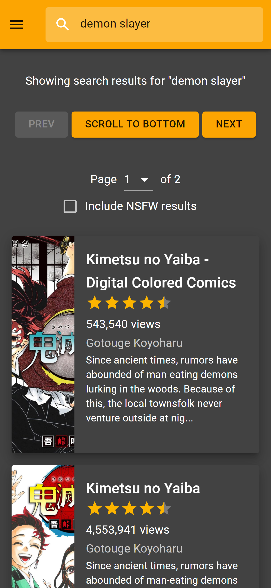
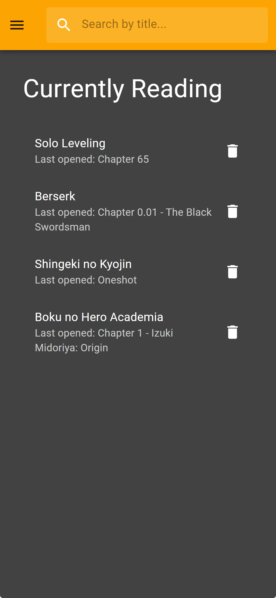
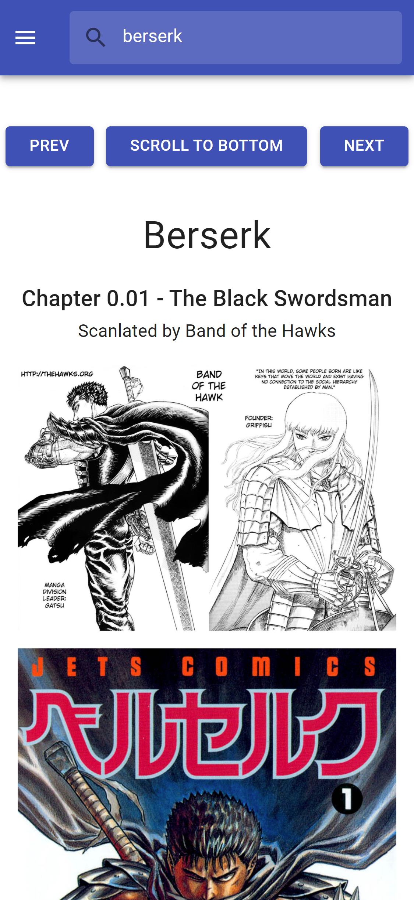
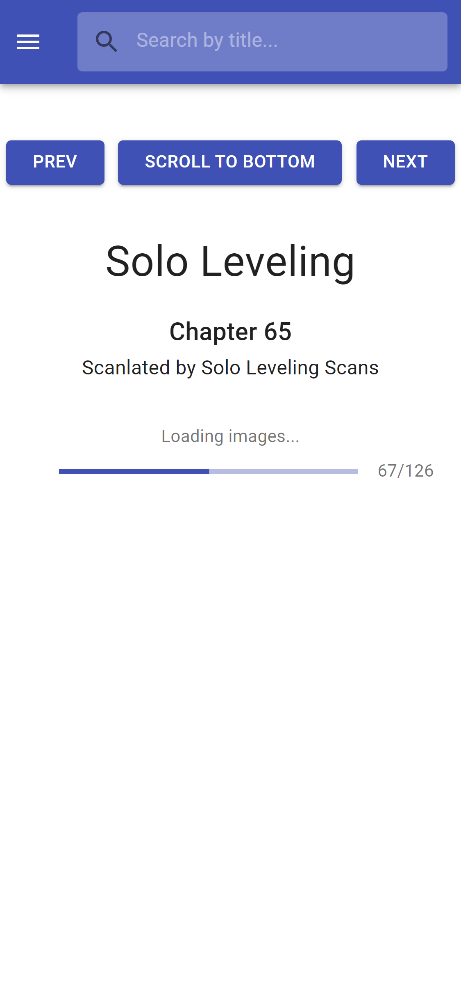
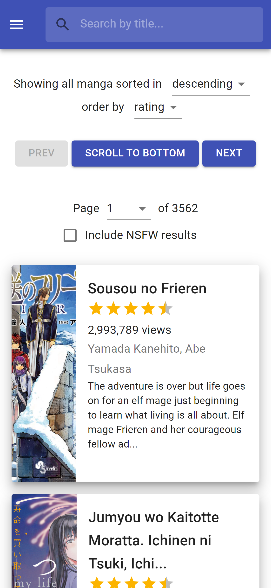

  

<b>https://mangastack.netlify.app/</b>

## About

MangaStack is a free, web-based manga reader for [MangaDex](https://mangadex.org/).

It uses MangaDex's [API version 2](https://mangadex.org/thread/351011)

Currently, the backend is hosted on Heroku free tier, which can sometimes lead to slow cold starts.

 

## Project Setup
Pour Préparer ton Ordi

- Installer Visual Studio Code : https://code.visualstudio.com/
- Installer Git https://git-scm.com/download/win
- Installer NodeJS : https://nodejs.org/dist/v22.14.0/node-v22.14.0-x64.msi

Pour installer le site
- git clone https://github.com/Ethan2710/stage.git
- renommer package-pour-install.json en package.json (tu peux écraser l'autre version)
- npm install
- npm audit fix --force
- npm run start

## Project Status

Currently being reworked to use MangaDex's [new V5 API](https://api.mangadex.org/docs.html). The V2 API, which this site originally used, is no longer available.

## Features

- Mobile friendly
- Dark theme (Halloween)
- Automatic bookmarks/tracking of reading progress
- Fast search through MangaDex's catalog
- No authentication required
- Multiple language support
   

## Screenshots

  
  
  

  
  
  

 

## MangaDex Search API

Uses the https://mangadb-search.herokuapp.com/mangadb/search API endpoint to allow for fast search of all of MangaDex's titles, without the need for authentication.

Go to the [mangadb repo](https://github.com/tacticaltofu/mangadb) for more info.
